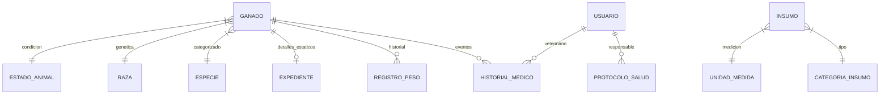

# Normalización de la Base de Datos
> **PRODUCTOR UNICO:** CRISTIAN J GARCIA | CI: 32.170.910 | Email: dicrisog252@gmail.com

Este documento explica el proceso de normalización aplicado a la base de datos de Agro-Master, detallando los motivos técnicos, los beneficios obtenidos y la implementación final.

## 1. Diagrama de Entidad-Relación (Etiquetado)

Este diagrama muestra la interconexión de los módulos nucleares y sus catálogos normalizados:

| Etiqueta | Relación | Lógica de Negocio |
| :--- | :--- | :--- |
| **GANADO -> ESPECIE** | Muchos a Uno | Un animal pertenece a 1 especie; permite reportes agregados. |
| **GANADO -> HISTORIAL** | Uno a Muchos | Permite reconstruir la vida clínica completa del animal. |
| **INSUMO -> CATEGORIA**| Muchos a Uno | Separa lógica de stock (Alimento vs Medicinas). |
| **USUARIO -> ACCIÓN** | Muchos a Muchos | Control de auditoría: quién hizo qué y cuándo. |

---

## 2. ¿Por qué se normalizó? (El Problema)

Originalmente, la base de datos almacenaba la información de forma "plana". Campos como `especie`, `raza`, `sexo` y `estado` se guardaban como simples cadenas de texto (Strings) repetitivas dentro de la tabla `Ganado`.

**Riesgos de la estructura anterior:**
*   **Inconsistencia de Datos:** Un usuario podía escribir "Bovino", otro "bovino" y otro "Vaca", dificultando la agrupación y generación de reportes precisos.
*   **Redundancia:** Almacenar miles de veces la palabra "Holstein" ocupa innecesariamente más espacio que un simple ID numérico.
*   **Dificultad de Mantenimiento:** Si se deseaba cambiar el nombre de una raza, había que editar miles de registros.
*   **Falta de Validación:** No había una lista "oficial" de opciones permitidas a nivel de base de datos.

## 2. ¿Para qué se hizo? (Los Objetivos)

1.  **Integridad Referencial:** Asegurar que cada animal pertenezca a una especie y raza válida existente en catálogos predefinidos.
2.  **Eficiencia en Consultas:** Las búsquedas por IDs numéricos son significativamente más rápidas que las búsquedas por texto.
3.  **Escalabilidad:** Facilitar la adición de nuevos atributos a especies o razas (ej. periodo de gestación por especie) sin alterar la tabla de animales.
4.  **Reportes Precisos:** Garantizar que el Dashboard y las exportaciones agrupen los datos sin errores ortográficos.

## 3. ¿Cómo se hizo? (La Implementación)

El proceso siguió las reglas de la **Segunda y Tercera Forma Normal (2NF y 3NF)**:

### A. Creación de Tablas de Catálogo
Se crearon tablas dedicadas para cada categoría estática:
*   `Especie`: Almacena nombres únicos (Bovino, Ovino, etc.).
*   `Raza`: Vinculada a una `especie_id` para evitar asignar razas de cabras a vacas.
*   `Sexo`, `EstadoAnimal`, `TipoAlimentacion`, `EstadoProtocolo`, etc.

### B. Reestructuración de la Tabla `Ganado`
Se eliminaron las columnas de texto y se reemplazaron por **Claves Foráneas (Foreign Keys)**:
*   `especie_id` (FK -> `Especie`)
*   `raza_id` (FK -> `Raza`)
*   `estado_id` (FK -> `EstadoAnimal`)
*   `sexo_id` (FK -> `Sexo`)

### C. Abstracción en Capa de Aplicación
Para mantener la sencillez en el Frontend, se implementó el método `.to_dict()` en el modelo `Ganado`. Este método "resuelve" los IDs y devuelve el nombre real (ej. devuelve "Bovino" en lugar de `1`), permitiendo que el JavaScript siga funcionando sin cambios drásticos.

### D. Normalización de Inventario
Originalmente, el inventario era un registro plano. Se aplicó normalización para separar la categoría y la unidad de medida:
*   **Antes**: `Insumo(nombre="Vacuna", categoria="Médico", unidad="ml")`
*   **Ahora**: `Insumo(nombre="Vacuna", categoria_id=1, unidad_id=2)`
*   **Beneficio**: Permite filtrar insumos por categoría de forma exacta (evitando errores como "Medico" vs "Médico") y realizar conversiones de unidades de forma programática.

## 4. Estructura Final (Resumen)

| Tabla | Propósito | Relación |
| :--- | :--- | :--- |
| `Especie` | Catálogo maestro de tipos de animal. | 1:N con `Raza` y `Ganado` |
| `Raza` | Subtipos genéticos por especie. | N:1 con `Especie` |
| `Ganado` | Datos biológicos individuales. | FKs a todos los catálogos. |
| `Insumo` | Medicinas, alimento y herramientas. | FK a `CategoriaInsumo` y `UnidadMedida`. |
| `PlanNutricional` | Dietas personalizadas. | FK a `TipoAlimentacion`. |

## 5. Script de Migración y Población
Se desarrollaron scripts avanzados (`populate_db_final.py`) que aseguran la consistencia de los datos:
1.  **Limpieza**: Vacía las tablas para evitar duplicidad.
2.  **Catálogos**: Crea las entradas "oficiales" para especies, razas y categorías de inventario.
3.  **Generación**: Crea registros coherentes (ej: animales con pesos realistas según su especie y edad).
4.  **Integridad**: Valida que no existan huérfanos o FKs inválidas.
