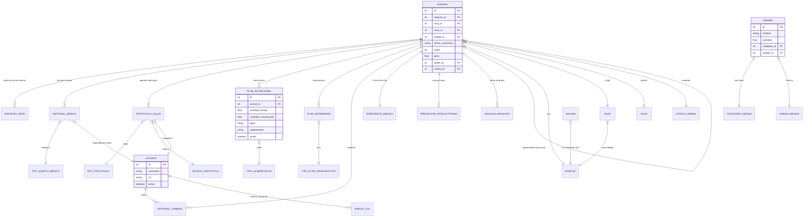

# Diagrama Entidad-Relación Integral (ERD)
> **PRODUCTOR UNICO:** CRISTIAN J GARCIA | CI: 32.170.910 | Email: dicrisog252@gmail.com

Este diagrama abarca la totalidad de las entidades y relaciones del sistema Agro-Master.

## Relaciones Críticas Operativas
1.  **Núcleo Biológico (`GANADO`)**: Es la entidad pivote. Casi todas las tablas nacen de un ID de animal.
2.  **Sistema de Usuarios (`USUARIO`)**: No solo gestiona el acceso, sino que vincula responsabilidades en `HistorialMedico` y `Protocolos`, actuando como la firma auditiva de cada acción.
3.  **Catálogos Normalizados**: Garantizan que el sistema no colapse por errores tipográficos en especies o unidades de medida.
4.  **Integridad en Cascada**: El borrado de un animal elimina automáticamente sus registros de peso y dietas para evitar datos huérfanos.
